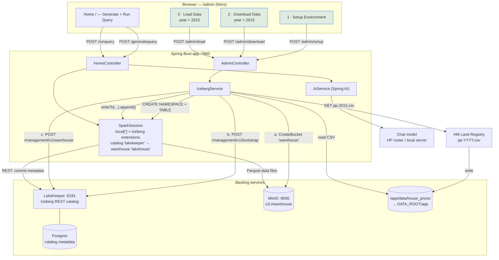
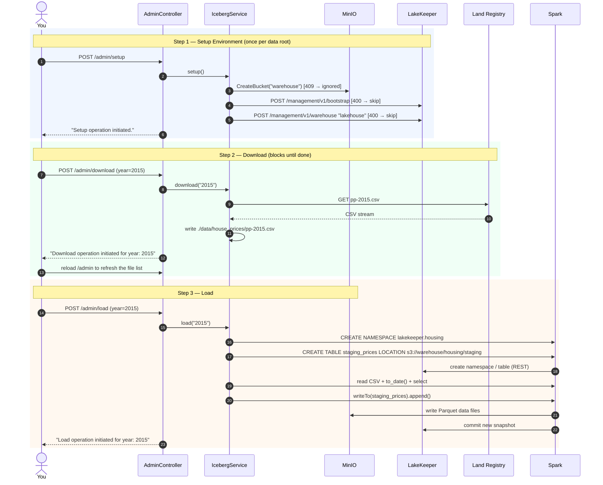

# Setup Flow — Admin → Setup Environment → Download → Load

This is the one-time bootstrap you run before the app can answer any question. Every step
is a button on `/admin`; each button is an htmx `POST` that runs **synchronously** inside
the request and swaps a one-line message into the page.

> The message always reads `... operation initiated.` — `AdminController` adds it
> unconditionally after the service call returns. It is **not** a success signal. The real
> outcome (`✅` / `Error ...`) only goes to the container logs, so keep
> `docker logs -f big-data-ai` open while you do this.

---

## Step 0 — Run the stack

```bash
docker build -t big-data-ai-app .

docker run -d --name big-data-ai \
  -p 7860:7860 -p 8181:8181 -p 9000:9000 -p 9001:9001 \
  -v "$PWD/data":/data \
  --env-file .env \
  big-data-ai-app

docker logs -f big-data-ai      # leave this running
```

`docker-entrypoint.sh` starts Postgres → LakeKeeper → MinIO, then the Spring Boot app, and
symlinks `/app/data` → `${DATA_ROOT}/app` so downloaded CSVs land on the mounted volume
(`./data/app/house_prices` on the host).

`HF_TOKEN` in `.env` is only needed for **Generate Query** on the home page. Setup,
download and load all work without it.

Wait until the log shows Spring Boot started, then open **http://localhost:7860/admin**.

---

## Step 1 — Setup Environment

Click **Setup Environment** → `POST /admin/setup` → `IcebergService.setup()`
(`src/main/java/dev/prpatel/iceberg/tools/IcebergService.java:191`).

Three things happen, in order:

| # | Action | Target | Idempotent? |
|---|--------|--------|-------------|
| 1 | `CreateBucket("warehouse")` | MinIO at `app.s3.endpoint`, creds `minio` / `minio1234` | yes — HTTP 409 swallowed |
| 2 | `POST /management/v1/bootstrap` `{"accept-terms-of-use": true}` | LakeKeeper at `app.catalog.base-url` | yes — 400 logged as *"already bootstrapped - skipping"* |
| 3 | `POST /management/v1/warehouse` | LakeKeeper | yes — 400 logged as *"already exists - skipping"* |

The warehouse registered in step 3 is named **`lakehouse`**, points at the `warehouse`
bucket with `path-style-access: true`, `flavor: minio`, `sts-enabled: true`, and embeds the
same `minio` / `minio1234` access key. That name has to match
`spark.sql.catalog.lakekeeper.warehouse=lakehouse` in `SparkConfig`, and the S3 credentials
are hardcoded in Java — so **changing `MINIO_ROOT_USER`/`MINIO_ROOT_PASSWORD` breaks this
step**.

Note steps 2 and 3 use LakeKeeper's *Management* API over plain `HttpClient`, not the
Iceberg REST catalog protocol — that is why they aren't done through `RESTCatalog`.

**Verify:** logs show three `✅` lines, and the MinIO console
(http://localhost:9001, `minio` / `minio1234`) lists a `warehouse` bucket.

Run this once per fresh data root. Nothing happens automatically at startup.

---

## Step 2 — Download Data

Type a year — e.g. **`2015`** — into the *Year* field under **Download Data**, click
**Download Data** → `POST /admin/download?year=2015` → `IcebergService.download(year)`.

* Fetches `http://prod.publicdata.landregistry.gov.uk.s3-website-eu-west-1.amazonaws.com/pp-<year>.csv`
  (UK Land Registry Price Paid data, headerless CSV, ~1M rows/year).
* Saves to `./data/house_prices/pp-<year>.csv`, relative to the app's working dir
  (`/app` in the container → the mounted volume).
* **Leave the year blank** and it downloads **2015 through 2025** in parallel (pool of up to
  10). That is the valid range hardcoded in `download()` — the placeholder text says
  `2023` but any year outside 2015–2025 just returns a non-200 and is logged as `Failed:`.
* Files that already exist are skipped (`Skipped: pp-2015.csv (already exists)`).

The HTTP request blocks until the download finishes and there is no progress bar. Watch for
`✓ Downloaded: pp-2015.csv` in the logs, then **reload `/admin`** — the *Files already
downloaded* list is rendered on `GET /admin` only, so it will not update by itself.

---

## Step 3 — Load Data

Enter the **same year** under **Load Data**, click **Load Data** →
`POST /admin/load?year=2015` → `IcebergService.load(year)`.

1. `CREATE NAMESPACE IF NOT EXISTS lakekeeper.housing`
2. `CREATE TABLE IF NOT EXISTS lakekeeper.housing.staging_prices (...) USING iceberg
   LOCATION 's3://warehouse/housing/staging'` — 16 columns, each with a `COMMENT` describing
   the Land Registry field.
3. Reads `data/house_prices/pp-<year>.csv` with `header=false` and an explicit 16-field
   schema; `date_of_transfer` is read as a string and parsed with
   `to_date(..., "yyyy-MM-dd HH:mm")`.
4. Re-`select`s the columns in table order and **appends**:
   `transformedDf.writeTo("lakekeeper.housing.staging_prices").append()`.

Spark runs embedded in the app in `local[*]` mode, so a full year takes a few minutes and
real memory. Iceberg data files go to MinIO under `s3://warehouse/housing/staging`; only
the table metadata lives in LakeKeeper/Postgres.

Three things worth knowing:

* **Order matters.** Load before Setup and the table's `s3://warehouse` location has no
  registered warehouse behind it. Load before Download and you get `File not found: ...`
  logged and nothing else — the request still returns "Load operation initiated".
* **It appends, it does not upsert.** Loading the same year twice doubles the rows. Use
  **Clear Data** first if you need to redo a load.
* **Blank year loads every file** in `data/house_prices` (skipping `.gitkeep`).

**Verify:** logs show `✅ Data loaded successfully from data/house_prices/pp-2015.csv`.

---

## Step 4 — Use it

Go to **http://localhost:7860/**.

* **Generate Query** → `POST /generatequery` → `AiService.generateQuery()` sends your
  question plus the hardcoded column schema to the chat model
  (`Qwen/Qwen3.6-27B:ovhcloud` via the HF router by default, `temperature=0.0`) and returns
  bare Spark SQL against `lakekeeper.housing.staging_prices`.
* **Run Query** → `POST /runquery` → `spark.sql(...)` against the Iceberg table; the first
  **100** rows are rendered.

## Housekeeping

**Clear Data** → `DROP TABLE IF EXISTS lakekeeper.housing.staging_prices PURGE`. It removes
the table and its data files but leaves the namespace, the warehouse registration, and the
downloaded CSVs alone — so after clearing you go straight back to **Load Data**, not Setup.

---

## Flow diagram



### Sequence — the three admin clicks


