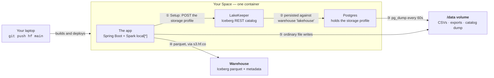

# Workshop: Lakehouse + AI Analyst, entirely on Hugging Face

**Format** 3.5–4 hours, hands-on · **Audience** technical (backend / data / platform engineers)
· **Starting point** this repo, already deployable as a Docker Space.

> **Bonus material:** [`WORKSHOP-BONUS-LABS.md`](WORKSHOP-BONUS-LABS.md) has twelve further labs —
> build-a-feature depth, sorted by audience background — for the optional slot, a second session, or
> take-home work. [`WORKSHOP-FEATURE-LABS.md`](WORKSHOP-FEATURE-LABS.md) has twelve more, written as
> product tickets from a fictional client rather than as technology topics.

Attendees leave with a running Space of their own, an Iceberg warehouse whose data files sit in
their own Hugging Face bucket, an ingest job that runs on HF compute instead of their laptop, and
— the part they will actually reuse at work — a text-to-SQL eval harness and a model bake-off
they ran themselves.

---

## The design principle

Every lab has to pass two tests:

1. **Useful anywhere.** The skill transfers even if the attendee never opens huggingface.co again —
   catalog/storage separation, SQL guardrails, eval-driven model selection, batch/serving split.
2. **Better on HF.** The HF service isn't a detour; it's the shortest path to the result.

Labs that only pass test 2 are marketing. Labs that only pass test 1 could be run anywhere and
waste the venue. Every lab below is scored against both.

---

## Prerequisites — send these out a week ahead

Non-negotiable, and worth a reminder email the night before. Forty minutes of workshop time
disappears if people arrive cold.

**1. Create one token with Full Access.** At
[hf.co/settings/tokens](https://huggingface.co/settings/tokens): **New token** → type
**Fine-grained** → name it `workshop` → click the **Full Access** preset → **Create**. Copy it; it is
shown once.

Everything the day needs is covered: creating a Space and a bucket, pushing over git, calling
Inference Providers, starting Jobs, publishing a dataset, and the S3 credentials Lab 3 derives from
it. There is a minimum set (see the appendix at the end of this file) but do not use it in a
workshop — a token missing one box authenticates perfectly and then fails with
`AccessDenied … Unknown`, naming no permission. That is unrecoverable in a room.

Everything lives in the attendee's **own namespace**, so only the *User permissions* section
matters. No organisation is involved.

**2. Install the CLI and log in:**

```bash
curl -LsSf https://hf.co/cli/install.sh | bash -s
hf auth login --add-to-git-credential     # paste the token; also lets git push
hf auth whoami                            # confirms which account the token belongs to
```

**3. Run the pre-flight — two calls, and the second is the one that matters.**

```bash
# inference works, and the credit is on the account
curl -s https://router.huggingface.co/v1/chat/completions \
  -H "Authorization: Bearer $(hf auth token)" -H "Content-Type: application/json" \
  -d '{"model":"openai/gpt-oss-120b:cheapest",
       "messages":[{"role":"user","content":"say ok"}]}'

# the token can WRITE - a read check passes with a read-only token and proves nothing
hf buckets create $(hf auth whoami | grep -o 'user=[^ ]*' | cut -d= -f2)/preflight --private
hf buckets delete $(hf auth whoami | grep -o 'user=[^ ]*' | cut -d= -f2)/preflight --yes
```

A completion and a clean create/delete means the day will work. Anything else means there is a week
to fix it rather than ten minutes.

- A **write** token, and separately a token with **inference** permission (or one fine-grained
  token carrying both — `Make calls to Inference Providers` + write).
- `git`, an editor, and any HTTP client they like.
- **No Docker. No Java. No Maven.** The workshop runs entirely on push-to-deploy, deliberately —
  see below.

**Optional, and only if it is done at home on home broadband:** the local loop needs
Docker Desktop, JDK 21 and Maven, and pulls roughly **700 MB per person** — about 220 MB of
container images (`postgres:18-alpine` 112 MB, `minio` 55 MB, `lakekeeper` ~50 MB compressed) plus
around 500 MB of Maven dependencies into `~/.m2` (Spark alone is 350 MB, Iceberg another 95 MB).
Across 25 people that is roughly **17 GB over the venue wifi**, which is not a thing to attempt in
a conference centre. Anyone who wants it should run `docker compose pull` and
`mvn dependency:go-offline` before they travel.

Optional but useful: an SSH key added at hf.co/settings/keys (needed for the Dev Mode finale).

---

## Presenter prep — do this a week out, not the night before

| # | Task | Why it matters |
|---|------|----------------|
| 1 | **Get credits onto each attendee's account**, and confirm at least one has landed before the day | Jobs need a positive credit balance, and so does inference past the free tier. Credits on their own account mean no org, no `--namespace`, and no `X-HF-Bill-To` — it all bills to them. Budget ~$2 each; $5 is generous. |
| 2 | **Decide whether the Space runs on MinIO or on a bucket** | Both work. Bucket-backed means the data is real Parquet on the Hub from minute one, and Lab 3 becomes a demo rather than an exercise; MinIO-backed keeps Lab 3 as a hands-on lab. Either way, hand out the recipe — it is not discoverable. |
| 3 | Pre-download `pp-2015.csv` into a **public** HF bucket or dataset repo | The Land Registry origin is one shared 170 MB download for the whole room. Serving it from HF is faster *and* demonstrates the point. |
| 4 | Decide the **fallback venue** for the AI labs | If the venue's egress is bad, inference still works (it's a small API call) but Space builds may not. Have a pre-built Space per attendee as plan B. |
| 5 | Confirm **PRO** on your own account | Dev Mode (the finale) is PRO/Team/Enterprise only. Attendees on free accounts watch that one rather than do it. |

### How expensive is a rebuild, actually

Measured on this machine today, so the numbers are real rather than guessed:

| Build | Time |
|---|------|
| **First build**, `docker build --no-cache`, wall clock | **70 seconds** — 64 s of which is one step, `mvn dependency:go-offline`, pulling the Spark tree. `apt-get install postgresql-18` was 10 s; every other step under 5 s |
| **Subsequent push**, one Java file changed — on Hugging Face | **under 60 seconds**, from this Space's own build logs |
| The same warm rebuild locally | **~5 seconds** — `dependency:go-offline` CACHED, `mvn package` 3.1 s, every apt/MinIO/LakeKeeper layer CACHED |

Two things make this cheap, and both are already true of the Dockerfile as written:

- **The layer order is right.** `COPY pom.xml` and `dependency:go-offline` come before `COPY src`,
  so a source change never re-resolves the Spark dependency tree. That single 63-second step is
  paid once and then cached — which is why the warm rebuild is five seconds.
- **Hugging Face reuses Docker layers between commits to a Space**, so attendees get the warm path
  from their second push onwards. The gap between HF's minute and the local five seconds is image
  export and container start, not compilation.

**There is nothing here worth optimising.** An earlier draft of this document recommended publishing
a prebuilt base image to a registry so attendees' first build would be fast. That advice was built on
an estimate of 8–15 minutes for a cold build, which I never measured and which is wrong by an order
of magnitude. Seventy seconds, once, while you are still doing introductions, does not need a
prebuilt base image. The recommendation is withdrawn.

### What it costs you

Rough, for 25 attendees over 4 hours:

| Item | Basis | Estimate |
|------|-------|----------|
| Spaces (cpu-upgrade, if you upgrade at all) | 25 × 4 h × ~$0.03/h | ~$3 |
| Jobs — Lab 4 | 25 × 15 min × $1.90/h (`cpu-performance`) | ~$12 |
| Jobs — if you use `cpu-upgrade` instead | 25 × 15 min × $0.03/h | ~$0.20 |
| Inference — Labs 1, 2 | 25 × ~150 calls, small open models | ~$5–15 |
| Buckets | free allowance | $0 |

**≈ $20–40 total.** That number is itself a slide: the whole workshop costs less than lunch for
two people, because everything bills by the minute and idles at zero.

---

## Timeline

The spine is Labs 0–3. Everything after is chosen live based on how the room is doing.

| Time | Block |
|------|-------|
| 0:00 – 0:15 | Intro: what a lakehouse is, what the app does, **start your Space build now** (it builds while you talk) |
| 0:15 – 0:45 | **Lab 0** — Ship the thing |
| 0:45 – 1:25 | **Lab 1** — Make the analyst trustworthy |
| 1:25 – 1:35 | Break |
| 1:35 – 2:05 | **Lab 2** — Model bake-off |
| 2:05 – 2:40 | **Lab 3** — Move the warehouse onto Hugging Face |
| 2:40 – 2:50 | Break |
| 2:50 – 3:30 | **Pick one:** Lab 4 (Jobs) · Lab 5 (Publish + engine shootout) · Lab 6 (MCP) |
| 3:30 – 3:50 | Demos: everyone's Space added to a shared Collection |
| 3:50 – 4:00 | Wrap, where to go next |

**Running only 3 hours?** Do 0, 1, 2 and demo Lab 3 from the stage. Lab 1 is the one that must
not be cut — it's the reason technical people came.

---

## How attendees iterate — push to the Space

**The default and documented loop is push-to-deploy.** Edit locally, commit, push, watch the build.
Nothing is installed and nothing is downloaded: after the clone, each push is a few kilobytes of
diff, and every heavy thing happens on Hugging Face's builders rather than on the venue's wifi.

| Step | Time |
|------|------|
| `git push hf main` | seconds — the diff is tiny |
| Build on HF, layers cached | under 60 s |
| Space restart (Postgres, LakeKeeper, MinIO, then the app) | ~20–40 s |
| **Round trip** | **about 1½ to 2 minutes** |

That is slower than a local restart and it is completely workable, provided the labs are designed
around it:

- **Batch the edit, then push.** Write the whole change and push once. Read the build log while it
  runs — `hf spaces logs --build --follow` — rather than sitting on the Space page.
- **Make the thing you're iterating on a runtime parameter.** This is worth more than any deploy
  trick. Lab 2 is the example: rather than four deploys to try four models, spend the first push
  making the model a per-request option, then run the whole bake-off with no further deploys at all.
- **Space variables do not avoid a build.** Measured on 2026-09-02:
  `hf spaces variables add` puts the Space through `RUNNING → RUNNING_BUILDING →
  RUNNING_APP_STARTING`, and the build log gains a new entry. It takes the *cached* path so it is
  quick, and the old container keeps serving throughout (`RUNNING_BUILDING`, so no downtime) — but
  it costs about the same as a push. Use variables because they can't introduce a compile error,
  not because they're free.
- **Pair up.** Two people per Space halves the round trips and gives one person the build log while
  the other writes code. It is a better workshop for other reasons too.
- **Dev Mode is the real fix if the room has PRO** — SSH into the running Space, edit, hit Refresh,
  no rebuild at all. See the alternative finale.

---

## Local development — optional, and for you rather than the room

Verified on this machine on 2026-09-02. Attendees should not attempt this at the venue for the
bandwidth reasons above; it is how *you* build the material, and how anyone who set it up at home
can work faster during the day.

### The fastest loop — compose, with your jar mounted into the app container

**~9 seconds edit to live**, and it restarts *only* the app: Postgres, MinIO and LakeKeeper are
separate containers here, so they are never touched. Measured 2026-09-02.

Add a dev-only override — compose merges `compose.override.yaml` automatically, and it is the right
place for this because it keeps `compose.yaml` clean (add the filename to `.gitignore`):

```yaml
# compose.override.yaml — dev only
services:
  app:
    volumes:
      - ./target/big-data-ai-0.0.1-SNAPSHOT.jar:/app/app.jar:ro
```

```bash
docker compose up -d app                                  # services + app, jar mounted

mvn -o -q -B -DskipTests package && docker compose restart app     # ~9 s
```

| Step | Time |
|------|------|
| `mvn -o -DskipTests package` (warm, offline) | 6.3 s |
| `docker compose restart app` → serving | **3.1 s** |

Verified: the app container's `/app/app.jar` checksum matches the host's, and after the restart
`docker compose ps` showed `db`, `lakekeeper` and `minio` with unbroken uptime.

This is what the compose topology is *for*, and it is the answer to "can't I just restart the app
rather than everything?" — yes, but only where the app is its own container. In the single-container
image the entrypoint deliberately runs `java … &` and `wait`s on it so it can stay PID 1 and take a
final catalog dump on shutdown, so killing the JVM there stops the container.

### The faithful loop — single container, jar mounted

**~13 seconds edit to live**, in the full single-container topology — embedded Postgres, MinIO and
LakeKeeper, the real entrypoint, exactly what Spaces runs. Slower than the compose loop above
because `docker restart` takes the whole stack down and back up (6.3 s of it), but it is the one
that tells you the thing will actually work on Spaces. Use it before you push.

The entrypoint runs `java … -jar /app/app.jar`, so mounting your freshly built jar over that path is
all it takes:

```bash
docker build -t big-data-ai-app .        # once; ~5 s after the first time

docker run -d --name big-data-ai \
  -p 7860:7860 -p 8181:8181 -p 9000:9000 -p 9001:9001 \
  -v "$PWD/data":/data \
  -v "$PWD/target/big-data-ai-0.0.1-SNAPSHOT.jar":/app/app.jar:ro \
  --env-file .env big-data-ai-app
```

```bash
mvn -o -q -B -DskipTests package && docker restart big-data-ai    # ~13 s
```

Verified: `sha256sum /app/app.jar` inside the container matched the host's jar, and a changed
Thymeleaf template was served on the next request.

Both jar-mount loops sidestep the endpoint bug below, because the app sits inside a container that
shares a network with the services — so a single `app.s3.endpoint` value is correct for both the app
and LakeKeeper, and no `/etc/hosts` entry or `APP_*` override is needed.

### The alternative — services in containers, app on the host

Faster still (a Spring Boot restart rather than a container restart), but it needs a workaround and
it does not exercise the entrypoint.

**Add this line to `/etc/hosts` once** (needs sudo, and it is what makes it work — see the bug below):

```
127.0.0.1 minio lakekeeper
```

Then:

```bash
docker compose up -d lakekeeper      # pulls in db, migrate and minio via depends_on
                                     # — it does NOT start the app or trino
mvn spring-boot:run                  # no APP_* overrides needed
```

App on http://localhost:7860, MinIO console on 9001, and under compose the CSVs land directly in
`./data/house_prices`.

> This is better than the "run the container without publishing 7860" recipe currently in the
> README, which leaves a second, idle copy of the app running inside the container costing about a
> gigabyte of RAM. Starting `lakekeeper` alone gives you the services and nothing else.

#### The bug this avoids — worth understanding before a lab hits it

The README's from-source recipe says to override `APP_S3_ENDPOINT=http://localhost:9000`. That is
correct for the app's own S3 client, and **wrong for LakeKeeper**, because the same string is also
embedded in the warehouse definition the app POSTs to LakeKeeper — and LakeKeeper dials it too.
`application.properties` says as much: *"Both processes sit in the same network namespace in either
deployment, so a single value is correct for both."* With the app on the host and the services in
containers, that stops being true.

What happens next is genuinely hard to debug, and I reproduced it today:

- Inside the LakeKeeper container, `localhost:9000` is **LakeKeeper's own Prometheus metrics
  endpoint** (its metrics port defaults to 9000 — the Dockerfile moves it to 9191 for the
  single-container case, but `compose.yaml` does not).
- Warehouse validation does an S3 `GetObject` against that, gets Prometheus text back, and tries to
  gunzip it.
- LakeKeeper returns **`400 FileDecompressionError: invalid gzip header`**.
- `IcebergService.setup()` catches any 400 and prints **"Warehouse already exists - skipping..."**

So Setup Environment reports success, the log says the warehouse is already there, and
`GET /management/v1/warehouse` returns `{"warehouses":[]}`. Every later step fails for reasons that
look nothing like the cause.

The `/etc/hosts` line fixes it without touching code: `minio` now resolves for the host app (to the
published port) *and* for LakeKeeper (via compose DNS), so one string is correct for both again.

**The proper fix, if you want a lab out of it:** split the property in two —
`app.s3.endpoint` for the app's own client and something like `app.s3.catalog-endpoint` for the
value handed to LakeKeeper. Twenty minutes of work, and it makes the deployment topologies
independent. It would also be an honest addition to Lab 1's list of defects, since the root problem
is the same one: a 400 swallowed into a success message.

### The full rebuild — when you change the Dockerfile or the entrypoint

The jar mount above bypasses the build, so it cannot test a change to `Dockerfile` or
`docker-entrypoint.sh`. For those, rebuild properly and run without the jar mount:

```bash
docker build -t big-data-ai-app .
docker run -d --name big-data-ai \
  -p 7860:7860 -p 8181:8181 -p 9000:9000 -p 9001:9001 \
  -v "$PWD/data":/data --env-file .env big-data-ai-app
```

### What was verified

| Check | Result |
|-------|--------|
| `docker build` from a clean context | **passes**, exit 0, 1.14 GB image |
| Base image drift — `eclipse-temurin:21-jre` | now Ubuntu 26.04 "resolute"; `postgresql-18` (18.6) still in main, so the Dockerfile's assumption holds |
| Pinned tags still published | MinIO `RELEASE.2025-09-07T16-13-09Z` ✓ · LakeKeeper `v0.10.2` ✓ — both with arm64 |
| Apple Silicon | builds and runs **native aarch64**, no emulation |
| Container startup | app, LakeKeeper and MinIO all answer 200; Spring Boot up in ~2 s after the services |
| Setup Environment | ✅ bucket · ✅ bootstrap · ✅ warehouse |
| Load → query | 500-row synthetic year loaded, `GROUP BY town` returned correct counts |
| Iceberg write path | Parquet under `warehouse/housing/staging/data/`, metadata JSON + Avro manifest alongside |
| `.snapshots` metadata table | readable — so bonus lab B1 works as written |
| Compose services-only | `docker compose up -d lakekeeper` starts db + migrate + minio + lakekeeper, and nothing else |
| App from source against those services | starts in ~20 s; bucket ✅ and bootstrap ✅, but **warehouse creation fails** — see the bug above |

Two incidental findings worth knowing:

- **The MCP server is already auto-configuring.** Startup logs show
  `McpServerAutoConfiguration` enabling resource, prompt and completion capabilities — the starter is
  live with zero tools registered. Lab 6 / B6 is adding tools to a running server, not standing one up.
- **A harmless startup warning**: `NoProviderFoundException` from
  `OptionalValidatorFactoryBean` — no Jakarta Validation provider on the classpath. Nothing uses bean
  validation today. If a lab adds `@Valid` on a request parameter it will silently do nothing until
  someone adds `spring-boot-starter-validation`; worth knowing before a table loses twenty minutes to it.

## Two storage paths, and how each one is configured

This is the part that is genuinely confusing, so it is worth being explicit: a bucket-backed Space
writes to Hugging Face storage **two different ways**, and only one of them is a volume.



**① Setup Environment is where the location is stated — once.** The app takes the `APP_S3_*`
settings and POSTs them to LakeKeeper as a *storage profile*: endpoint, bucket, key-prefix, region,
STS flag, and the access key. Nothing else in the system hardcodes where data lives.

**② LakeKeeper remembers it**, stored in Postgres against the warehouse named `lakehouse`. That is
the answer to *"how does LakeKeeper know where to look?"* — you told it at Setup, and it kept it.

**③ Postgres is dumped to the volume** every 60 seconds and on shutdown, which is how the catalog
survives a restart. The cluster itself is rebuilt from that dump on every boot.

**④ Spark never reads `APP_S3_*` to find the data.** It asks the catalog. `SparkConfig` only knows
the LakeKeeper URL and the warehouse name `lakehouse`; when a table is created or loaded, LakeKeeper
replies with an `s3://…` location, and Spark writes Parquet straight to `s3.hf.co`. That is the
answer to *"how does the app know?"* — the catalog is the middleman, which is exactly what an
Iceberg REST catalog is for.

> The one exception is credentials. Normally LakeKeeper vends those too, but the HF gateway has no
> STS, so `APP_S3_CLIENT_SIDE_SIGNING=true` hands Spark the same access key to sign its own
> requests. That is why the key appears in two places: LakeKeeper needs it to validate and write
> metadata, Spark needs it to write data files.

**⑤ CSVs and exports are plain file writes** to the mounted volume. No S3, no catalog — just
`data/house_prices/…` relative to the working directory.

### Why two buckets

The volume and the warehouse are different mechanisms — a managed filesystem mount versus an S3
endpoint — so give them separate buckets. One bucket can serve both if the warehouse sits under its
own prefix, but that is untested here, and mixing Iceberg's UUID directories with `app/` and
`lakekeeper-catalog.sql` at the same root is harder to read when something goes wrong.

---

## Attendee setup, in full

```bash
# 1. the code
git clone <workshop-repo> big-data-ai && cd big-data-ai

# 2. the Space
hf repos create <you>/big-data-ai --type space --sdk docker --private

# 3. two buckets: one for the volume, one for the warehouse
hf buckets create <you>/lakehouse --private
hf buckets create <you>/warehouse --private

# 4. mount the first one as /data
hf spaces volumes set <you>/big-data-ai --volume hf://buckets/<you>/lakehouse:/data

# 5. S3 credentials for the second one
#    hf.co/settings/tokens -> your token's ... menu -> Generate S3 credentials
#    (UI only - there is no CLI or API for this)
hf spaces secrets add <you>/big-data-ai \
  --secrets HF_TOKEN=hf_xxx \
  --secrets APP_S3_ACCESS_KEY=HFAK... \
  --secrets APP_S3_SECRET_KEY=...

# 6. tell the app about the warehouse
hf spaces variables add <you>/big-data-ai \
  --env APP_S3_ENDPOINT=https://s3.hf.co \
  --env APP_S3_BUCKET=<you> \
  --env APP_S3_KEY_PREFIX=warehouse \
  --env APP_S3_STS_ENABLED=false \
  --env APP_S3_CREATE_BUCKET=false \
  --env APP_S3_CLIENT_SIDE_SIGNING=true \
  --env APP_WAREHOUSE_EXPLICIT_LOCATION=false \
  --env AWS_REQUEST_CHECKSUM_CALCULATION=when_required

# 7. deploy
hf auth login --add-to-git-credential
git remote add hf https://huggingface.co/spaces/<you>/big-data-ai
git push --force hf main
hf spaces logs <you>/big-data-ai --build --follow
```

**`APP_S3_BUCKET` is your username, not the bucket name.** LakeKeeper refuses a storage endpoint
that carries a path, and HF buckets are addressed as `namespace/bucket` — so the namespace has to
play the part of the S3 bucket, and the real bucket name becomes `APP_S3_KEY_PREFIX`. It reads
wrongly and is correct.

The entrypoint sees a non-local `APP_S3_ENDPOINT` and skips MinIO by itself; there is no switch to
set.

### What this costs, and what it buys

**Buys:** the warehouse is genuine Parquet on the Hub from the first load — openable with
`pd.read_parquet("hf://buckets/…")`, by DuckDB, by a Job, or in the Hub's file preview. One fewer
process (~120 MB). And it retires a quiet risk: the entrypoint keeps Postgres off `DATA_ROOT`
because object storage offers no atomic rename or durable `fsync`, and MinIO's `xl.meta` writes lean
on the same guarantees with no dump to fall back on.

**Costs:** step 5 is **UI-only, once per attendee** — no CLI, no API. Budget five minutes and expect
a few people to swap the access key and the secret. And **Lab 3 stops being a lab**, because what it
teaches is now the starting state.

> If you would rather keep Lab 3 hands-on, run the attendees' Spaces on MinIO — drop steps 3 (second
> bucket), 5's two `APP_S3_*` secrets and all of step 6 — and make only **your own** Space
> bucket-backed for the demo.

---

## Lab 0 — Ship the thing (30 min)

**Goal** Everyone has a URL that answers a question in English, backed by their own data.

Attendees deploy by **pushing to the Space's git remote**, which is also the dev loop they will
use for the rest of the day: edit locally, commit, push, watch it build.

```bash
# 1. Get the code
git clone <workshop-repo-url> big-data-ai && cd big-data-ai

# 2. Your own Space — Docker SDK, private
hf repos create <you>/big-data-ai --type space --sdk docker --private

# 3. Storage for it — an HF bucket mounted where the app expects /data
hf buckets create <you>/lakehouse --private
hf spaces volumes set <you>/big-data-ai --volume hf://buckets/<you>/lakehouse:/data

# 4. Credentials for the LLM call
hf spaces secrets add <you>/big-data-ai --secrets HF_TOKEN=hf_xxx

# 5. Push. This is what triggers the build.
hf auth login --add-to-git-credential          # so git can authenticate over HTTPS
git remote add hf https://huggingface.co/spaces/<you>/big-data-ai
git push --force hf main

# 6. Watch it build, then wait for it to come up
hf spaces logs <you>/big-data-ai --build --follow
hf spaces wait <you>/big-data-ai
```

Three things to say out loud while they run this:

- **`--force` on the first push is expected, not a mistake.** `hf repos create` initialises the Space
  with its own README commit, so your local `main` has unrelated history. The Space is seconds old
  and empty; force-push it. (The alternative,
  `git pull hf main --allow-unrelated-histories`, means resolving a README conflict in front of the
  room — do that only if you enjoy it.)
- **The README's YAML frontmatter is the Space's config.** `sdk: docker` is what makes it build the
  Dockerfile, and the app listens on 7860, which is HF's default `app_port`, so no override is
  needed. If someone's Space builds and then 404s, that frontmatter is the first place to look.
- **`data/` is gitignored** and `.gitattributes` already carries the standard HF LFS rules, so the
  push is a couple of hundred kilobytes. Nobody should ever commit a `pp-YYYY.csv`.

Prefer SSH? `git remote add hf git@hf.co:spaces/<you>/big-data-ai` works once their key is at
[hf.co/settings/keys](https://huggingface.co/settings/keys), and skips the credential-helper step.

Then, at `https://<you>-big-data-ai.hf.space/admin`: **Setup Environment** → **Download Data**
(`2015`) → **Load Data** (`2015`). Then ask the home page a question.

**What they learn** Docker Spaces are just a Dockerfile and a port; secrets vs. variables; a bucket
volume is how a Space gets state that survives a restart; the Hub page is an iframe wrapper, so
`/admin` lives on the `hf.space` subdomain.

**Talking point while builds run** Walk through `SETUP_FLOW.md` — the three admin buttons and what
each touches. This is dead time otherwise; use it.

**Trap to pre-empt** The admin buttons always answer *"… operation initiated"* whether or not the
work succeeded. Teach `hf spaces logs --follow` in the first ten minutes; they'll need it all day.

---

## Lab 1 — Make the analyst trustworthy (40 min)

The highest-value lab. `AiService.generateQuery()` as written is a realistic first draft with
realistic problems, and the attendees get to find them.

Hand them the code and this question: **what could go wrong here?**

```java
Dataset<Row> resultsDF = spark.sql(generatedsql);   // HomeController, straight from the LLM
```

The list they should reach:

| Defect | Exercise |
|--------|----------|
| Model output goes to `spark.sql()` unvalidated — `DROP TABLE` is one prompt injection away | Add a guard that parses the statement and rejects anything that isn't a single `SELECT`. Spark's `ParserInterface` gives you a real parse tree; a regex does not. |
| Schema is a hardcoded string in `AiService.fieldsInData` — it silently rots the moment the table changes | Read the schema from the catalog at runtime (`spark.catalog`/`DESCRIBE TABLE`) and cache it |
| No `LIMIT`, and results render 100 rows regardless | Inject a `LIMIT` when the model omits one |
| Response may arrive fenced in ```` ```sql ```` — sometimes | Ask for **structured output** (JSON schema: `{sql, columns_used, assumptions}`) instead of stripping fences forever |
| Nothing measures whether any of this got better | ↓ |

**Then the actual deliverable: a ten-question eval set.**

Ten questions with a known-correct answer — an expected row count, an expected aggregate, or an
expected shape (`GROUP BY town`, filters on `date_of_transfer`). A tiny runner that fires all ten
and scores: *generated?* · *parses?* · *executes?* · *right answer?* Plus latency per question.

Make it boring and text-based — a CSV of questions and a JUnit test or a shell loop is enough. The
point is that it exists.

**Why this is the best lab in the workshop** Everyone in the room has shipped an LLM feature with
no way to tell whether a prompt change helped. They leave with the smallest thing that fixes that,
and Lab 2 immediately pays them back for building it.

**Useful anywhere** ✅ entirely portable · **Better on HF** ✅ the model swap in Lab 2 is one string

---

## Lab 2 — Model bake-off on Inference Providers (30 min)

Now the eval harness earns its keep. **Start by making the model a runtime parameter — this is the first half of the lab.** The model
is currently pinned in `application.properties` and baked into the `ChatClient` at construction, so
comparing four models the obvious way costs four deploys. One push fixes that: have
`AiService.generateQuery()` take a model name and set it per call, then expose it on the page next
to the question box.

```java
chatClient.prompt()
    .options(OpenAiChatOptions.builder().model(modelId).build())   // per-request override
    .system(systemPrompt).user(userPrompt).call().chatResponse();
```

After that push, **the entire bake-off runs with no further deploys** — and the eval harness from
Lab 1 can loop over all four models in a single run instead of being run four times.

> Don't reach for Space variables here. `SPRING_AI_OPENAI_CHAT_MODEL` does bind onto
> `spring.ai.openai.chat.model` via relaxed binding, but changing a variable puts the Space through
> `RUNNING_BUILDING` — it's a cached rebuild, roughly the cost of a push (measured 2026-09-02).
> Variables are useful because they can't introduce a compile error, not because they're free.

"the model is a request parameter, not a deployment" is also the right answer outside the workshop,
which makes this a good twenty minutes regardless of the bake-off.

```bash
# What's actually being served right now, and by whom
hf models list --warm --limit 40
hf models list --inference-provider groq --warm
hf models list --inference-provider cerebras --warm
```

Each attendee runs the ten-question eval against four configurations and fills in a table:

| Config | What it selects |
|--------|-----------------|
| `Qwen/Qwen3.6-27B:ovhcloud` | today's default — a pinned provider |
| `openai/gpt-oss-120b:fastest` | highest throughput available |
| `openai/gpt-oss-120b:cheapest` | lowest price per output token |
| `<a small model>` | is 27B even needed for text-to-SQL over 16 columns? |

Columns: **accuracy /10 · median latency · cost**. Then pool the room's results on a whiteboard.

Two settings that materially change the answer and are already in `application.properties`, so
have them try flipping each:

- `spring.ai.openai.chat.reasoning-effort=none` — the file records 21.7 s with thinking vs 1.2 s
  without. Does accuracy actually drop? Measure it, don't assume.
- `spring.ai.openai.chat.temperature=0.0` — raise it and watch reproducibility fall apart.

**What they learn** Provider routing as a real dial (`:fastest` / `:cheapest` / `:preferred` /
`:provider`); that the biggest model is often the wrong default; that "which model" is an empirical
question they now have the tooling to answer. Everything bills to each attendee's own credit
balance, so there is nothing to configure and nothing shared to exhaust.

**Useful anywhere** ✅ · **Better on HF** ✅✅ one token, one base URL, ~20 providers, no per-vendor
signup — this comparison is a week of procurement anywhere else

---

## Lab 3 — Move the warehouse onto Hugging Face (5 min explanation, not a lab)

> **You chose bucket-backed Spaces, so this is already done** before anyone arrives — the warehouse
> is on a Hugging Face bucket from the first load. Keep it as a short explanation at the top of an
> hour: show the bucket page, open a Parquet file, and explain what would be there instead if MinIO
> were in the path (`<name>.parquet/xl.meta` directories nothing else can read). The mechanics below
> are what you would walk through, and what to fall back on if you switch attendees to MinIO and
> want it hands-on again.

**Verified end to end on 2026-09-05.** An Iceberg catalog knows *where* your table is; it doesn't
care whose object store that is. Cut MinIO out, put the data files in a Hugging Face bucket, and
change no query code.

```bash
hf buckets create <you>/warehouse --private
```

Then hf.co/settings/tokens → your token's ⋯ menu → **Generate S3 credentials** → an access key
starting `HFAK…` and a secret shown once. Configure the app:

```properties
app.s3.endpoint=https://s3.hf.co
app.s3.bucket=<your-namespace>       # the NAMESPACE, not the bucket - see below
app.s3.key-prefix=warehouse          # the bucket name goes here
app.s3.access-key=HFAK...
app.s3.secret-key=...
app.s3.sts-enabled=false
app.s3.create-bucket=false
app.s3.client-side-signing=true
app.warehouse.explicit-location=false
```

Reload a year, then open `https://huggingface.co/buckets/<you>/warehouse` and watch Iceberg's
`metadata/` and `data/` directories appear — as **real Parquet**, openable with
`pd.read_parquet("hf://buckets/…")`. That moment is the one people photograph, and it is the
difference between "the bytes are on the Hub" and "the data is on the Hub".

### Four things that must all be right

Each of the last three fails with an error pointing somewhere else entirely, which is why this lab
needs the recipe above rather than discovery:

| # | Requirement | What it looks like when wrong |
|---|-------------|-------------------------------|
| 1 | **AWS SDK ≥ 2.5x** with `apache-client` on the classpath | `403` with an empty body, or `ClassNotFoundException: ApacheHttpClient$Builder`. Iceberg 1.9.2 against a 2024-era SDK is the root cause; `S3FileIO` still builds an `ApacheHttpClient`, and that artifact stopped being transitive |
| 2 | **Endpoint with no path** | `Storage Profile 'endpoint' must not have a path`. HF buckets are `namespace/bucket` and S3 clients won't take a `/` in a bucket name, so the namespace becomes the S3 bucket and the bucket name becomes `key-prefix` |
| 3 | **No explicit `LOCATION`** | `Invalid location 's3://…'`. With a REST catalog the server places the table |
| 4 | **Token with read *and* write** on repo contents | `AccessDenied … Unknown` on `PutObject`, after a perfectly successful authentication. Read alone is not enough, and the S3 error names no permission |

> **Pre-flight, and make it a `PutObject`.** A `ListObjects` check passes with a read-only token and
> tells you nothing. Have attendees run an actual write before the lab.

### Why it is worth doing

Without this, the Space's MinIO stores objects under `${DATA_ROOT}/minio`, and `DATA_ROOT` is
already a Hugging Face bucket. So the data is on the Hub — as `…parquet/xl.meta` directories plus
opaque `part.1` files that only MinIO can read. Nothing else can open them: not pandas, not DuckDB,
not another Job, not the Hub's own file preview. Removing MinIO removes a translation layer that
sits between object storage and object storage, and turns the same bytes into something every tool
in the ecosystem understands.

## Lab 4 — Get the ingest off the Space (30 min)

**The problem, stated honestly:** `Download` and `Load` run *inside an HTTP request*, on the Space's
2 vCPU, with no progress and no retry. One year is tolerable. Eleven years is not. This is the
batch/serving split, and it's an architecture lesson before it's an HF lesson.

Rewrite ingestion as a Job that mounts the same bucket:

```bash
hf jobs uv run ingest.py \
  --with duckdb --with huggingface_hub \
  -v hf://buckets/<you>/warehouse:/data \
  --flavor cpu-performance \
  --timeout 1h

hf jobs logs <job-id> --follow
```

Then right-size it: run the same job on `cpu-basic` ($0.01/h) and `cpu-performance` ($1.90/h) and
compare wall-clock against cost. The finding is usually that the expensive flavor is *cheaper per
job* — a genuinely counterintuitive result people remember.

**Stretch, pick one:**

```bash
# Monthly refresh — the Land Registry publishes new data every month
hf jobs scheduled run '0 6 1 * *' python:3.12 python ingest.py
```

```python
# Or: re-ingest whenever the upstream dataset repo changes
from huggingface_hub import create_webhook
create_webhook(job_id=job_id, watched=[{"type": "dataset", "name": "<org>/price-paid"}])
```

**What they learn** Never do heavy lifting in a request handler; hardware right-sizing as a
measurement not a guess; per-minute billing changes how you size things; a cron and a webhook turn
a script into a pipeline.

**Useful anywhere** ✅✅ · **Better on HF** ✅ no cluster, no scheduler, no IAM — one command, and
the volume mount means the Job and the Space share storage with zero glue

---

## Lab 5 — Publish it, then check whether you needed Spark (25 min)

Export the Iceberg table to Parquet and publish it as a dataset repo:

```bash
hf upload <you>/uk-price-paid ./out --type dataset
```

Write the dataset card frontmatter, then open the repo page: the **Dataset Viewer** and its SQL
console are just *there*, for free, over the data they loaded twenty minutes ago.

Now the honest experiment. Same question, three engines:

| Engine | How |
|--------|-----|
| Spark + Iceberg | the app's Run Query |
| DuckDB over the published Parquet | `hf datasets sql "SELECT town, avg(price) FROM … GROUP BY town"` |
| Hub Dataset Viewer SQL console | in the browser, no install |

Time all three on one year, then on eleven. **The crossover is the lesson.** For a single year on
one machine, DuckDB will very likely win, and saying so out loud buys enormous credibility — the
room already suspects it. Spark's case is the eleven-year load, the multi-node future, and Iceberg's
snapshots and schema evolution, not the single-node scan. Make that argument with numbers the
attendees generated themselves rather than asserting it from a slide.

**Useful anywhere** ✅✅ knowing when *not* to reach for Spark is a career skill · **Better on HF**
✅ the viewer, the SQL console and Xet dedup come free with the upload

---

## Lab 6 — Turn the lakehouse into a tool an agent can call (20 min, finale)

`spring-ai-starter-mcp-server-webmvc` is already in `pom.xml` and **completely unused** — nothing
in `src/` mentions MCP. So there's a real, small, satisfying build here.

Expose two MCP tools over the Space's existing HTTP port:

- `describe_table()` → the live Iceberg schema
- `run_query(sql)` → the guarded executor from Lab 1

Then point a coding agent at `https://<you>-big-data-ai.hf.space/mcp` and ask it a question in
English. It writes SQL, runs it against their warehouse, and reasons about the answer — with the
Lab 1 guardrail refusing anything that isn't a `SELECT`.

The framing: a Space isn't just a demo page, it's a publicly addressable, permissioned tool
endpoint that any agent can use. And the guardrail from Lab 1 is now load-bearing, because the
thing writing the SQL is fully autonomous.

**Useful anywhere** ✅✅ MCP is the integration surface everyone is being asked about ·
**Better on HF** ✅ a Space is a URL with auth and a scale-to-zero bill

---

## Alternative finale — Dev Mode (PRO only)

If most of the room is on PRO, this lands better as a live fix-a-bug exercise, because a Docker
Space rebuild is 8–15 minutes and Dev Mode skips it entirely.

**This repo isn't Dev Mode compatible yet, and making it so is the exercise.** Against the
documented requirements, the Dockerfile already has: Debian base ✅, `/app` owned by uid 1000 ✅,
`curl` ✅. It's missing:

- `wget`, `procps`, `git`, `git-lfs` in the `apt-get install` line
- a **`CMD`** instruction — the image only has `ENTRYPOINT`

Add those four packages, convert `ENTRYPOINT` to `CMD`, push, then:

```bash
hf spaces dev-mode <you>/big-data-ai
hf spaces ssh <you>/big-data-ai        # or VS Code Remote-SSH to <subdomain>@ssh.hf.space
```

Edit a prompt in the running container, hit **Refresh**, see it live. Then `git commit && git push`
*from inside the Space* to persist it — changes made in Dev Mode are discarded otherwise, which is
a foot-gun worth demonstrating deliberately rather than discovering.

---

## Closing (20 min)

- Everyone makes their Space public and adds it to a shared **Collection** — instant gallery of 25
  working lakehouses, and a permanent artifact of the day.
- Pool the Lab 2 bake-off numbers on the board. The winner is rarely the biggest model, and that
  slide writes itself from the room's own data.
- Show the org billing page. Four hours, 25 people, real infrastructure, ~$30.

**What to send afterwards:** the repo, the Collection link, the eval harness as a standalone gist,
and the one-line pitch for each service they touched.

---

## Risks, and what to do about them

| Risk | Mitigation |
|------|------------|
| 25 simultaneous cold Space builds at 0:15 | Not a real risk: the cold build is 70 s and it runs on HF's builders, not the venue's wifi. Everyone pushes during the intro and it is done before you finish talking. |
| Land Registry origin slow or down | Serve `pp-2015.csv` from your own public bucket (prep #3) |
| Attendees can't run Jobs — no credit balance | Everything bills to the workshop org: `--namespace`. Test with a free-tier account beforehand, not with the room. |
| Lab 3 gateway incompatibility | Dry run + pinned JSON + the MinIO fallback, decided in advance |
| Spark OOM on a Space's 2 vCPU / 16 GB | One year only in the core path. Eleven years belongs in Lab 4, where a Job has the RAM. |
| Room finishes early / late | Labs 4, 5 and 6 are independent — take one, two, or none |
| Dev Mode not available | It's PRO-gated; make it the alternative finale, not the main one |

---

## Why this set, and not the obvious one

The obvious Hugging Face workshop is *fine-tune a model, push it to the Hub, deploy it in a Space*.
There are a hundred of those, and the attendees who came to a data-engineering session don't want it.

This set instead uses HF as **infrastructure for a data platform** — object storage, batch compute,
a model router, a publishing surface, an agent endpoint — which is both the less-told story and the
one that actually maps onto the systems these attendees run at work. The Iceberg table on an HF
bucket is the image they'll describe to a colleague on Monday.

---

## Appendix — what "Full Access" actually grants

Every fine-grained permission Hugging Face offers, and whether this workshop touches it. Use
**Full Access** on the day; this table is for anyone who asks what they just agreed to.

| Group | Permission | Used here |
|-------|------------|-----------|
| Repositories | Read contents of your repos | ✅ clone, and Lab 3's S3 reads |
| Repositories | Write contents/settings of your repos | ✅ create the Space and bucket, `git push`, publish the dataset, Lab 3's S3 writes |
| Repositories | View access requests for your gated repos | — |
| Repositories | Read contents of public gated repos you can access | — |
| Inference | **Make calls to Inference Providers** | ✅ every AI lab |
| Inference | Make calls to your Inference Endpoints | — |
| Inference | Manage your Inference Endpoints | — |
| Jobs | **Start and manage Jobs** | ✅ Lab 4, and publishing the dataset from a Job |
| Collections | Write to your collections | ✅ the closing demo only |
| Collections | Read your collections | — |
| Webhooks | Create and manage webhooks | ✅ Lab 4 / PP-104 stretch only |
| Webhooks | Access webhooks data | — |
| Discussions & Posts | all three | — |
| Notifications | both | — |
| Billing | Read billing usage and payment method status | — |

**Why Full Access rather than the six that are ticked above.** A token missing one box
authenticates perfectly and then refuses the operation with `AccessDenied … Unknown`, naming no
permission — verified the hard way on 2026-09-05, where read-without-write cost an hour of
debugging with full context and a shell. In a room of twenty-five that is unrecoverable, and the
token is a throwaway scoped to one day's work on one account.
